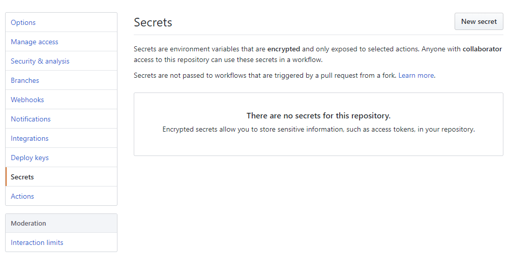
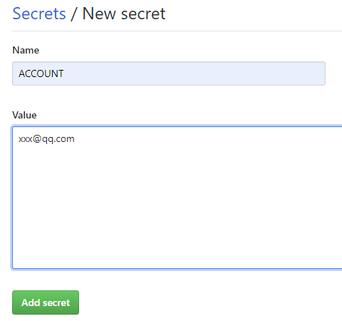
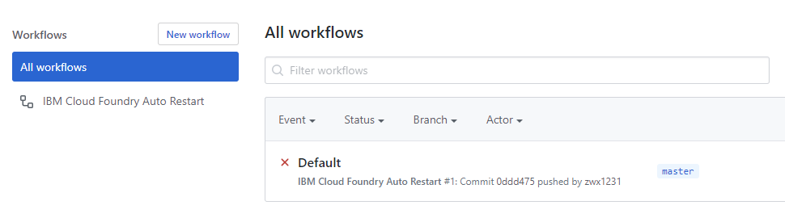
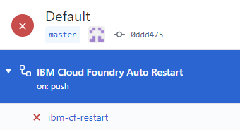
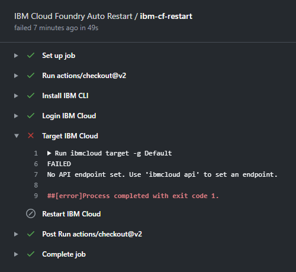

# IBM-CF-AutoRestart

Use it to restart IBM Cloud Foundry regularly

使用它定期重启你的 IBM Cloud Foundry


## Fork 本仓库

点击  右侧的  按钮


## 设置变量

点击项目下方最后一枚  按钮


选中左侧 Secrets 后右上角 点击 New secret ↓




在如下图的界面中添加变量 ↓




添加如下变量：

  ACCOUNT     ==>   IBM 账户邮箱

  PWD         ==>   IBM 账户密码

  REGION      ==>   Cloud Foundry 应用地区 (一般就是 us-south (达拉斯)
  
  与域地址是 us-south.cf.appdomain.cloud 还是另选了 mybluemix.net 无关

  APP_NAME    ==>   应用程序名, 区分大小写


## 激活 Actions

点击项目名下方第四枚  按钮


默认有一个叫 Default 的文件, 点击它 ↓




点击左侧 ibm-cf-restart ↓




如无意外 应该在 Target IBM Cloud 一栏停止 ↓




目光来到右上角Re-run all jobs即可 

### 跑起来吧！


#---#

## 自定义时间

#### 本项目默认每周一 5:00am 执行IBM Cloud Foundry 的自动重启
修改Code栏此路径下的run.yml文件

- IBM-CF-AutoRestart/.github/workflows/ 

自定义第九行

```
$ - cron: '0 5 * * 1'
```

中的内容即可
